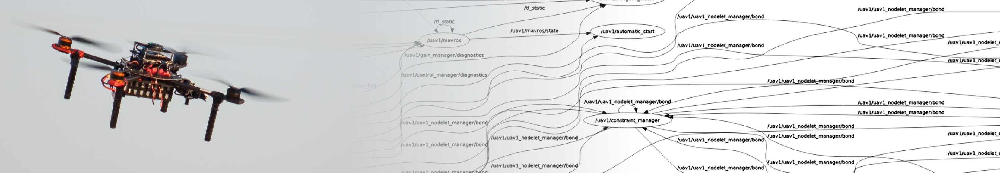

# MRS ROS messages



| Build status | [](https://github.com/ctu-mrs/mrs_msgs/actions) | [](https://github.com/ctu-mrs/mrs_msgs/actions) |
|--------------|---------------------------------------------------------------------------------------------------------------------------------|------------------------------------------------------------------------------------------------------------------------------|

## Documentation

[https://ctu-mrs.github.io/mrs_msgs](https://ctu-mrs.github.io/mrs_msgs).

## General Points

* **Centralized Interface Hub:** This package serves as the single source of truth for all custom message, service, and action definitions within the [MRS system](https://github.com/ctu-mrs/mrs_uav_system).
* **Strict Single-Package Policy:** To maintain system integrity, individual packages within the MRS ecosystem **must not** define their own custom interfaces. This architecture is enforced for several critical reasons:
    * **Dependency Decoupling:** Centralization prevents a "spaghetti" dependency graph. By ensuring all nodes depend on `mrs_msgs` rather than on each other for interfaces, we maintain a clean and linear build hierarchy.
    * **Data Portability (Rosbags):** When replaying legacy data, `mrs_msgs` is the only package required to decode the streams. Since it has no dependencies other than generic ROS message packages, it remains easy to compile across different distributions.
    * **Long-term Maintainability:** If interfaces were scattered, replaying an old bag would require compiling the specific versions of every package that originally defined those messages—a task that often fails as downstream dependencies break over time.

---

## Developer notes

### Message structure
The nested folder structure within `msg/`, `srv/`, and `action/` (e.g., `msg/general/`, `msg/errorgraph/`) is for **organizational clarity only**.

In the compiled code, these structures are **flattened**. There are no extra namespaces based on the folder names.
* **Source:** `msg/general/Float64.msg`
* **In Code:** `mrs_msgs/msg/Float64`

### How to generate docs
The project includes a CI-ready script that handles the documentation build (requires `rosdoc2`) and can be used for local builds as well:
```bash
./.ci/ci_generate_docs.sh
```
